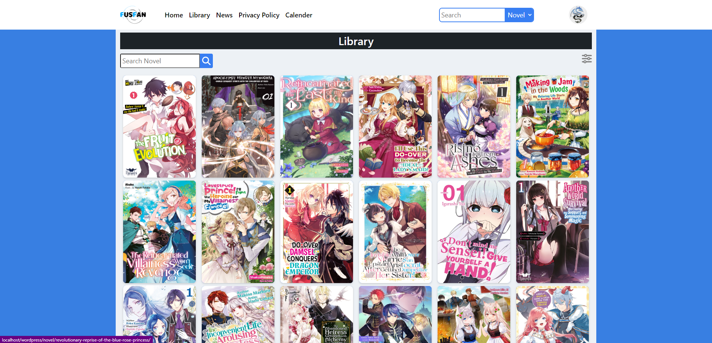
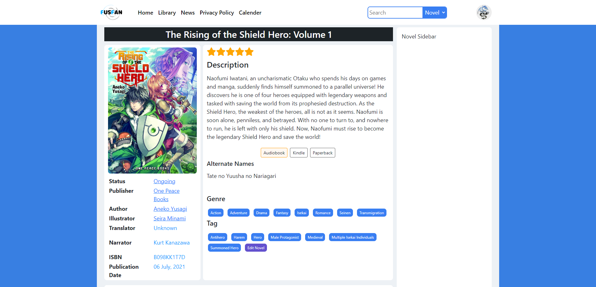
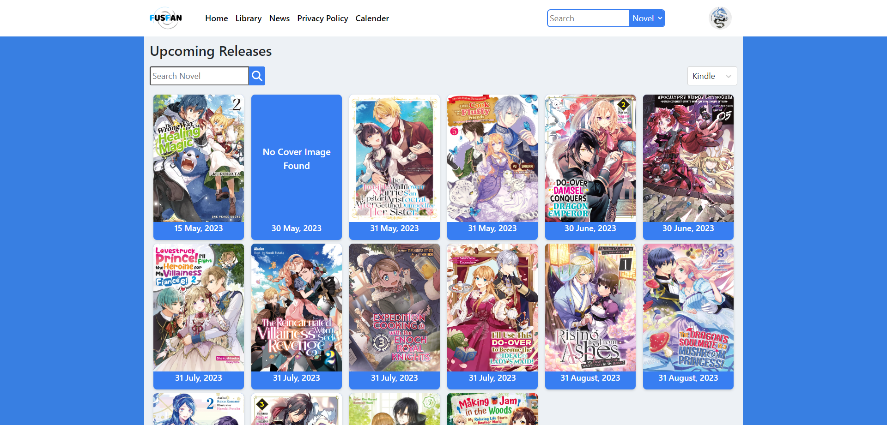
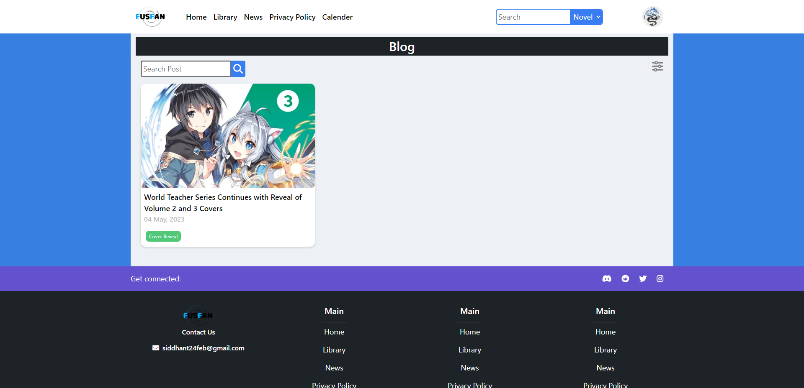

# LNarchive - The Light Novel Database Theme

LNarchive is a sleek and functional WordPress theme designed for light novel enthusiasts. It is a comprehensive database that keeps track of current and future releases, authors, illustrators, narrators, translators, and more. With a minimalist design, the theme allows users to search for specific light novels, filter by various criteria, and view detailed information about each novel. It also serves as a news and blog website for all things related to light novels, including reviews and editorials.

## Screenshots
<table>
  <tr>
    <td></td>
    <td></td>
  </tr>
  <tr>
    <td></td>
    <td></td>
  </tr>
</table>

## Development ( To be added )

**Install**

Clone the repo and run

```bash
npm install
```

**During development**

The following command will start the development enviornment.

```bash
npm run dev
```

**Production**

The following command will generate the production files.

```bash
npm run prod
```

**Cleaning**

The following command will clean the assests folder.

```bash
npm run clean
```

**Linting**

The following command will display all the linting error.

```bash
npm run lint
```

**Linting and Autofixing**

The following command will try fixing all the linting errors and then display all the linting errors which it cant handle.

```bash
npm run lint-fix
```